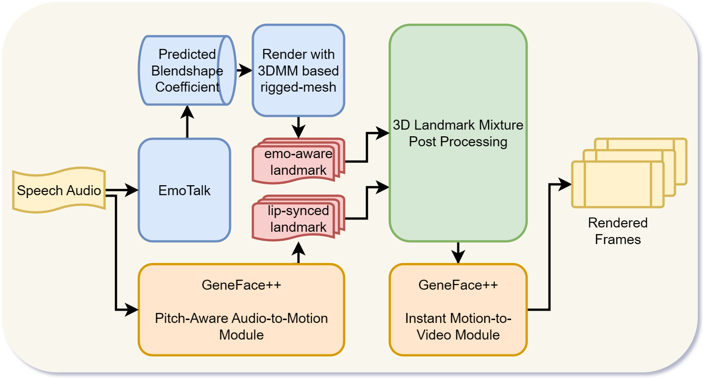
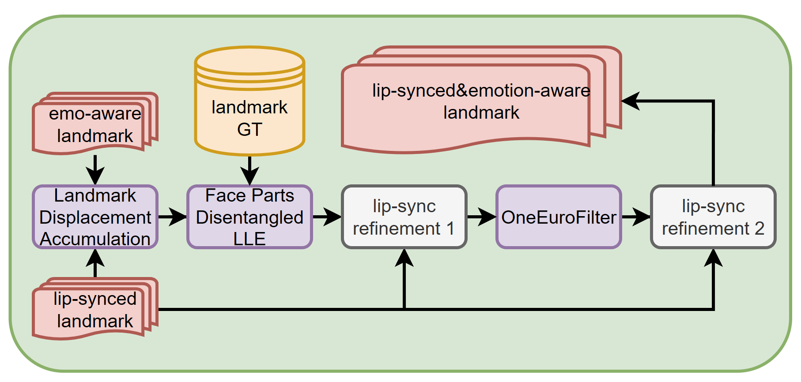

# EmoGene: EmoTalk + GeneFace++ for Emotional Talking Head Generation

We introduce EmoGene, a novel approach for generating emotional facial expressions from speech audio.

### EmoGene Pipeline Overview

Our method integrates the strengths of [EmoTalk](https://github.com/psyai-net/EmoTalk_release) and [GeneFace++](https://github.com/yerfor/GeneFacePlusPlus) to produce high-quality, emotion-aware talking head videos. The pipeline consists of four main components:
1. **Emotion-Aware Audio-to-3D Landmark Generation**: We utilize `EmoTalk` to convert speech audio into 3D facial landmarks, capturing the emotional nuances present in the audio.
2. **Lip-Synced Audio-to-3D Landmark Generation**: We employ the `Pitch-Aware Audio-to-Motion Module from GeneFace++` to generate accurate lip-syncing landmarks from the same audio input.

3. **3D Landmark Integration**: We design a novel post-processing module to effectively combine the outputs from `EmoTalk` and `GeneFace++`. This module enhances the emotional expressiveness of the 3D landmarks while maintaining lip-sync accuracy.
4. **3D Landmark-to-Video Synthesis**: Finally, we employ the `Instant Motion-to-Video Module of GeneFace++ `to synthesize realistic talking head videos from the emotion-enhanced 3D landmarks.

### EmoGene 3D Landmark Mixture Post-Processing Pipeline

In the post-processing module, the pipeline takes the 3D landmarks generated by `EmoTalk` and `GeneFace++` as inputs, consisting of five key steps:
1. **Landmark Alignment and Displacement Accumulation**: We first align the 3D landmarks generated by `EmoTalk` and `GeneFace++` and accumulate the displacements of each landmark point over mean face.
2. **Face Parts Disentangled Locally Linear Embedding(LLE)**: We then apply `locally linear embedding (LLE)` technique to each disentangled facial parts, allowing us to isolate and enhance specific emotional expressions.
3. **First Lip-Sync Refinement**: We take lip-region landmarks from `GeneFace++` as accurate lip-syncing reference of Mixed landmarks from the last step, refining the lip movements while preserving emotional expressions.
4. **One-Euro Filter Smoothing**: We apply an `One-Euro Filter` to smooth the temporal dynamics of the landmarks, reducing jitter and enhancing visual coherence.
5. **Final Lip-Sync Refinement**: Finally, we again use lip-region landmarks from `GeneFace++` to ensure the final landmarks maintain precise lip-syncing with the audio input.

## Demo Videos
We use different emotion audio inputs to generate emotion-aware talking head of `May`, including `neutral`, `happy`, `surprise`, `angry`, `sad`, `fearful`, `disgust`.

For each demo video, we provide comparisons from left to right:

||`EmoGene(ours)` || `GeneFace++` || `EmoGene landmarks(ours)` || `GeneFace++ landmarks`||

### Neutral
<!-- <video src="../assets/emogene/demo_videos/neutral_May_actor20.mp4" controls="controls" style="max-width: 720px;">
</video> -->
<video src="https://github.com/user-attachments/assets/e8320458-c013-4bd5-b09a-98691720e027" controls="controls" style="max-width: 720px;">
</video>

<!-- <video src="../assets/emogene/demo_videos/neutral_May_actor19.mp4" controls="controls" style="max-width: 720px;">
</video> -->
<video src="https://github.com/user-attachments/assets/8a7166f7-87d3-4e8a-bf75-58595ed29c5e" controls="controls" style="max-width: 720px;">
</video>

### Happy
<!-- <video src="../assets/emogene/demo_videos/happy_May_actor20.mp4" controls="controls" style="max-width: 720px;">
</video> -->
<video src="https://github.com/user-attachments/assets/88ad61df-cea5-4cff-abcf-d7860eda7aa1" controls="controls" style="max-width: 720px;">
</video>

<!-- <video src="../assets/emogene/demo_videos/happy_May_actor19.mp4" controls="controls" style="max-width: 720px;">
</video> -->
<video src="https://github.com/user-attachments/assets/a5e7a54d-5dc7-43de-bf7e-44d690d23e7d" controls="controls" style="max-width: 720px;">
</video>

### Surprise
<!-- <video src="../assets/emogene/demo_videos/surprised_May_actor20.mp4" controls="controls" style="max-width: 720px;">
</video> -->
<video src="https://github.com/user-attachments/assets/945fd19d-7402-4e6a-88f2-f35d2da0916c" controls="controls" style="max-width: 720px;">
</video>

<!-- <video src="../assets/emogene/demo_videos/surprised_May_actor19.mp4" controls="controls" style="max-width: 720px;">
</video> -->
<video src="https://github.com/user-attachments/assets/4e529b0d-870a-4232-b584-900e1393f2d8" controls="controls" style="max-width: 720px;">
</video>

### Angry
<!-- <video src="../assets/emogene/demo_videos/angry_May_actor20.mp4" controls="controls" style="max-width: 720px;">
</video> -->
<video src="https://github.com/user-attachments/assets/4214fbc1-9007-47f5-ab67-879083664d9e" controls="controls" style="max-width: 720px;">
</video>

<!-- <video src="../assets/emogene/demo_videos/angry_May_actor19.mp4" controls="controls" style="max-width: 720px;">
</video> -->
<video src="https://github.com/user-attachments/assets/e1dcbe06-574e-475d-b11d-f07e08b20226" controls="controls" style="max-width: 720px;">
</video>

### Sad
<!-- <video src="../assets/emogene/demo_videos/sad_May_actor20.mp4" controls="controls" style="max-width: 720px;">
</video> -->
<video src="https://github.com/user-attachments/assets/405218dc-08d0-438b-83f7-01694f639d37" controls="controls" style="max-width: 720px;">
</video>

<!-- <video src="../assets/emogene/demo_videos/sad_May_actor19.mp4" controls="controls" style="max-width: 720px;">
</video> -->
<video src="https://github.com/user-attachments/assets/bd3d901e-2447-4e4f-8aef-80e472d2f45b" controls="controls" style="max-width: 720px;">
</video>

### Fearful
<!-- <video src="../assets/emogene/demo_videos/fearful_May_actor20.mp4" controls="controls" style="max-width: 720px;">
</video> -->
<video src="https://github.com/user-attachments/assets/d72a8439-b559-4874-9114-983937d32c7b" controls="controls" style="max-width: 720px;">
</video>

<!-- <video src="../assets/emogene/demo_videos/fearful_May_actor19.mp4" controls="controls" style="max-width: 720px;">
</video> -->
<video src="https://github.com/user-attachments/assets/e6573691-3f73-4043-96a4-1fde594391f7" controls="controls" style="max-width: 720px;">
</video>

### Disgust
<!-- <video src="../assets/emogene/demo_videos/disgust_May_actor20.mp4" controls="controls" style="max-width: 720px;">
</video> -->
<video src="https://github.com/user-attachments/assets/24ddb45d-4a61-4d0a-84d7-52d108756fbf" controls="controls" style="max-width: 720px;">
</video>

<!-- <video src="../assets/emogene/demo_videos/disgust_May_actor19.mp4" controls="controls" style="max-width: 720px;">
</video> -->
<video src="https://github.com/user-attachments/assets/85bc4452-351c-4faf-a914-f7587d970a45" controls="controls" style="max-width: 720px;">
</video>

