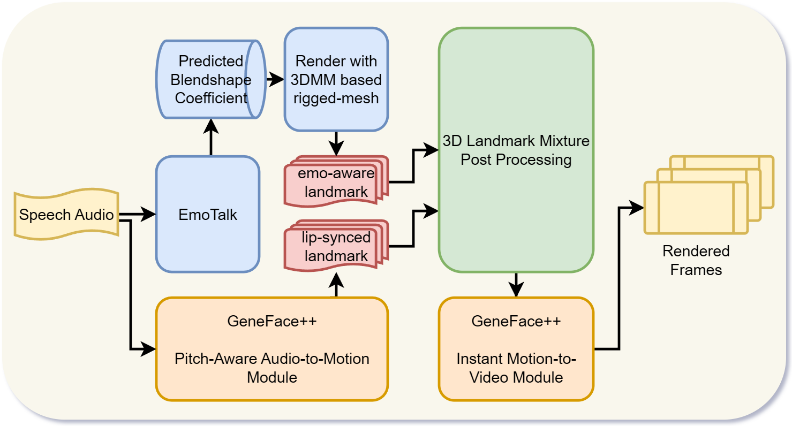

# EmoGene: EmoTalk + GeneFace++ for Emotional Talking Head Generation

We introduce EmoGene, a novel approach for generating emotional facial expressions from speech audio.
- EmoGene Pipeline Overview:

- EmoGene 3D Landmark Mixture Post-processing Pipeline:

## Demo Videos
For each demo video, we provide the following comparisons:

||`EmoGene(ours)` || `GeneFace++` || `EmoGene landmarks` || `GeneFace++ landmarks`||

### Neutral
<video src="../assets/emogene/demo_videos/neutral_May_actor20.mp4" controls="controls" style="max-width: 720px;">
</video>

<video src="../assets/emogene/demo_videos/neutral_May_actor19.mp4" controls="controls" style="max-width: 720px;">
</video>

### Happy
<video src="../assets/emogene/demo_videos/happy_May_actor20.mp4" controls="controls" style="max-width: 720px;">
</video>

<video src="../assets/emogene/demo_videos/happy_May_actor19.mp4" controls="controls" style="max-width: 720px;">
</video>

### Angry
<video src="../assets/emogene/demo_videos/angry_May_actor20.mp4" controls="controls" style="max-width: 720px;">
</video>

<video src="../assets/emogene/demo_videos/angry_May_actor19.mp4" controls="controls" style="max-width: 720px;">
</video>

### Sad
<video src="../assets/emogene/demo_videos/sad_May_actor20.mp4" controls="controls" style="max-width: 720px;">
</video>

<video src="../assets/emogene/demo_videos/sad_May_actor19.mp4" controls="controls" style="max-width: 720px;">
</video>

### Fearful
<video src="../assets/emogene/demo_videos/fearful_May_actor20.mp4" controls="controls" style="max-width: 720px;">
</video>

<video src="../assets/emogene/demo_videos/fearful_May_actor19.mp4" controls="controls" style="max-width: 720px;">
</video>

### Disgust
<video src="../assets/emogene/demo_videos/disgust_May_actor20.mp4" controls="controls" style="max-width: 720px;">
</video>

<video src="../assets/emogene/demo_videos/disgust_May_actor19.mp4" controls="controls" style="max-width: 720px;">
</video>

### Surprise
<video src="../assets/emogene/demo_videos/surprised_May_actor20.mp4" controls="controls" style="max-width: 720px;">
</video>

<video src="../assets/emogene/demo_videos/surprised_May_actor19.mp4" controls="controls" style="max-width: 720px;">
</video>

