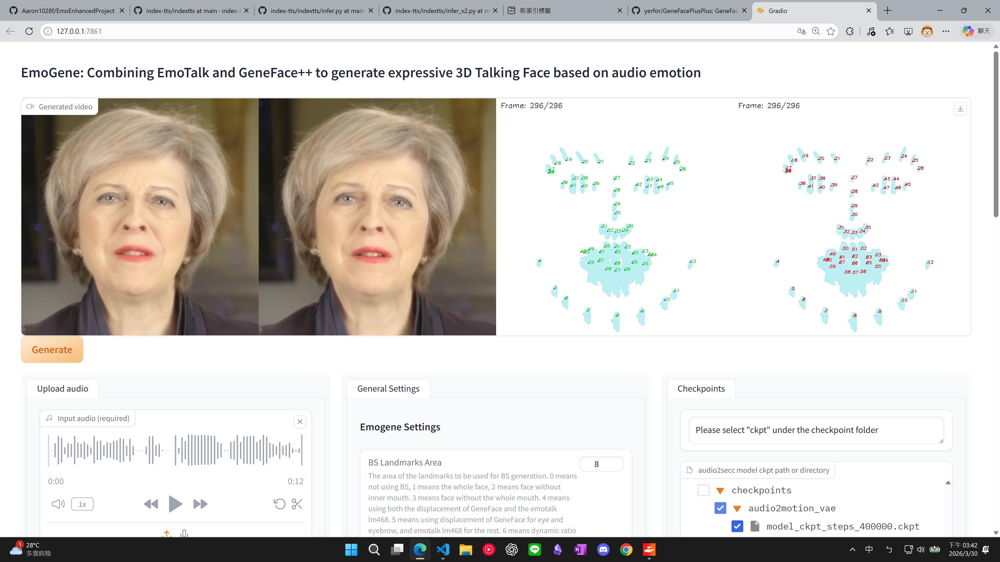

# Install EmoGene (enhance GeneFace++ using EmoTalk)

We use EmoTalk to enhance the emotion expression of GeneFace++. To use EmoGene, you need to install the `GeneFace++` model and the `EmoTalk` model, and then use our script to integrate them.

## 1. Install GeneFace++ from official repo
To install GeneFace++, follow the steps in https://github.com/yerfor/GeneFacePlusPlus. You can also follow the instruction in `docs/environment/conda_geneface.md` to set up the conda environment or handle some common installation issues. This step will take a long time. Make sure you can run the official demo script successfully, and you can go to next step.

(Install in `server/models/` ==> Then we have `server/models/GeneFacePlusPlus/`)


## 2. Install EmoTalk from official repo
To install EmoTalk, follow the steps in https://github.com/psyai-net/EmoTalk_release. Please note that the conda environment is compatible with the geneface conda environment, you don't need to (and do not) create a new conda environment, just run the demo of EmoTalk to make sure you can run it successfully.

(Install in `server/models/GeneFacePlusPlus/`
==> Then we have `server/models/GeneFacePlusPlus/emotalk`)

## 3. Use our modified version of GeneFace++ for emotion enhancement demo

###  3.1 Copy our modified version of GeneFace++ to your local GeneFace++ directory
Copy the contents of `server/models/GeneFacePlusPlus/emogene` to your local GeneFace++ directory and put them in the correct directory, you can follow the directory structure in this repository. 


Copy `server/models/GeneFacePlusPlus/emotalk/render_testing_92.blend` and `server/models/GeneFacePlusPlus/emotalk/feng_rigged.blend` to the corresponding directories in your local EmoTalk directory.

The main script for the demo is `server/models/GeneFacePlusPlus/emogene/app_emogene.py`, which is a gradio demo to show the emotion enhancement results of EmoGene.

### 3.2 Run the demo script for EmoGene
```bash
# geneface conda environment with python 3.9 (official, 3.9 is indeed for the gradio app)
conda activate geneface 

# go to the directory of GeneFace++ and run the demo script
cd server/models/GeneFacePlusPlus/

# run the demo app
python emogene/app_emogene.py

```

The gradio demo will be like:



## (4.) Install GeneFace conda environment with python 3.10

If you just need to run EmoGene with gradio demo, **you don't need to do this step**.

Otherwise, if you want to run the `ChatBot App: (STT+VAD->RAG+LLM->RAG+TTS->Talking Head Generation)`, maybe you will need to use the python 3.10 environment to avoid some dependency issues (fastapi). 

Try the python 3.9 environment first, if you encounter some dependency issues, then you can try to set up the python 3.10 environment and run the demo script in that environment.

You can follow the instruction in `docs/environment/conda_geneface_py10.md` to set up the conda environment with python 3.10, and then run the following command to check if the environment is set up correctly.

```bash
conda activate geneface_py310
cd server/models/GeneFacePlusPlus/
python inference/genefacepp_infer.py
```
