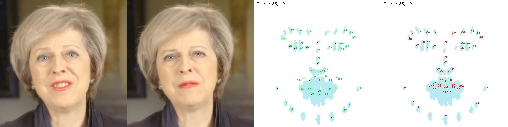
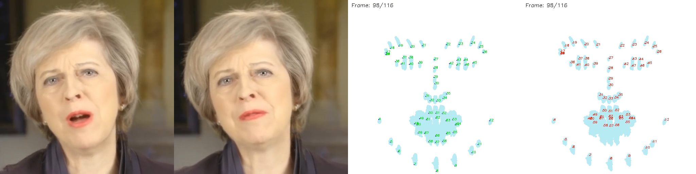
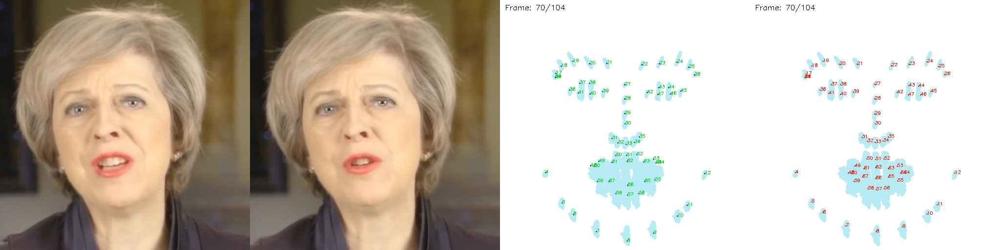
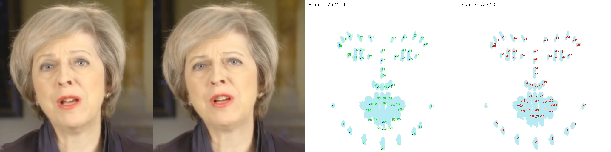
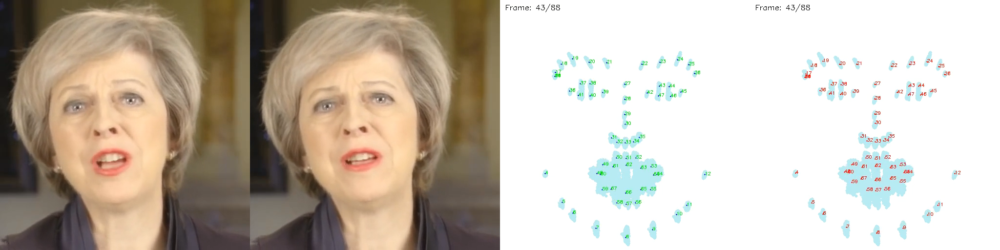
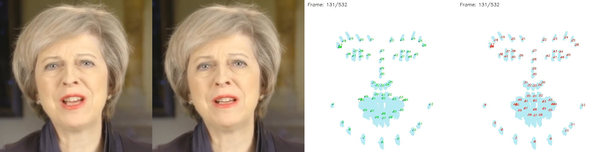

# Emotion Enhanced Talking Head Bot

## EmoGene: Combining EmoTalk and GeneFace++ for Emotion-Enhanced Talking Head Generation
See `docs/emogene.md` for more details of **[Model Pipeline and Video Demo](https://github.com/Aaron1028f/EmoEnhancedProject/blob/main/docs/EmoGene.md)**.

Go `server/models/GeneFacePlusPlus/emogene` for code and more implementation details of **EmoGene**.

---

### Demo of EmoGene results 
The following pictures show the results of EmoGene given different emotions.

For each picture, we provide comparisons from left to right:

||`EmoGene(ours)` || `GeneFace++` || `EmoGene landmarks(ours)` || `GeneFace++ landmarks`||

#### **Happy**

#### **Surprised**

#### **Angry**

#### **Sad**

#### **Fearful**

#### **Neutral**

#### **Laughter in Audio**

<!-- ## Bot: now available: (VAD+STT)->(RAG+LLM)->(TTS)
See `docs/note/run_all_server_client.md` for more details.

**Models**
- (VAD+STT): call chatgpt API
- (RAG+LLM): langchain
- (TTS): GPT-SoVits

**frontend and network communication**
- [LiveKit](https://docs.livekit.io/home/) -->
