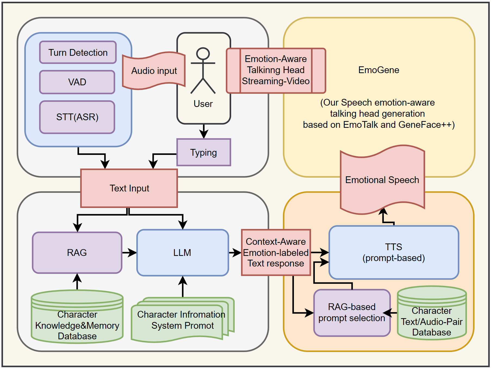
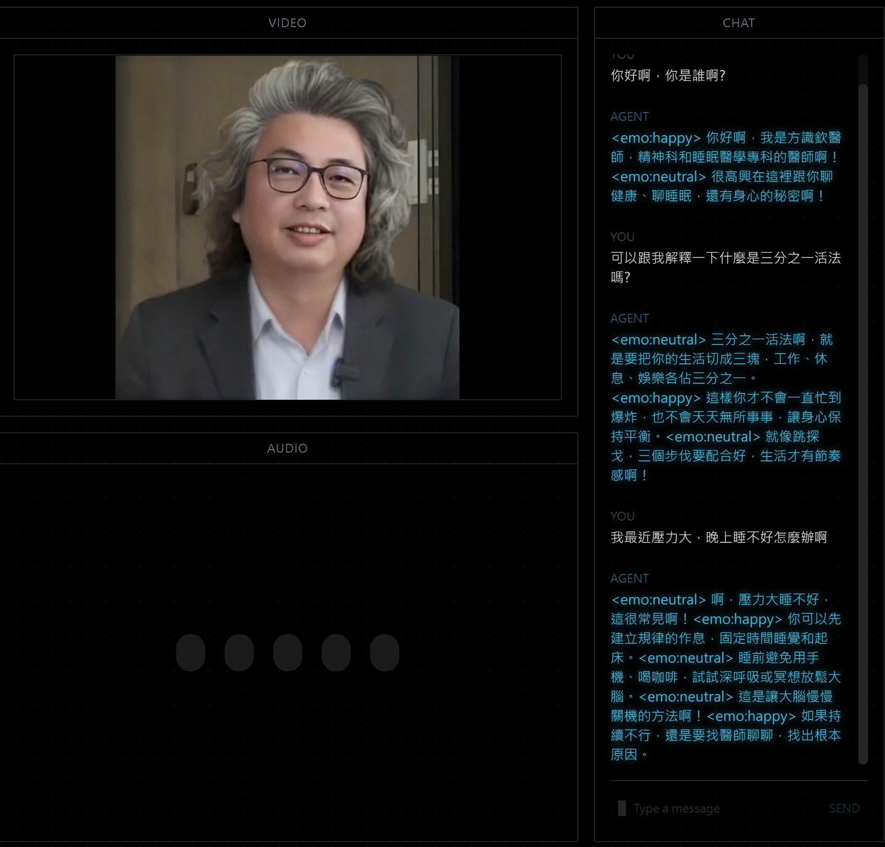
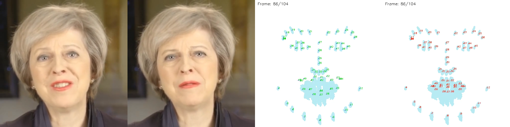
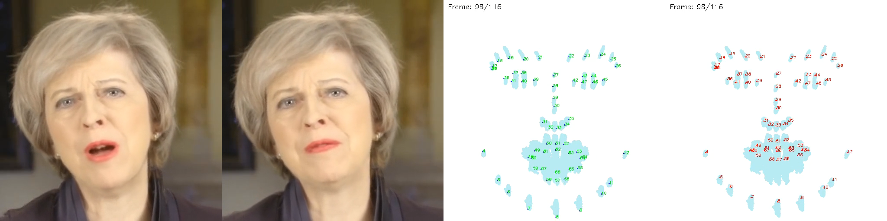
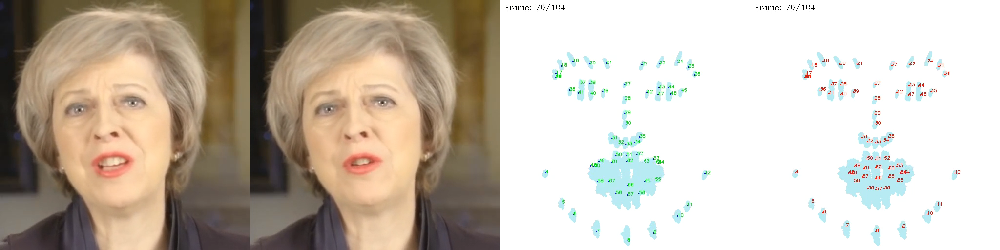
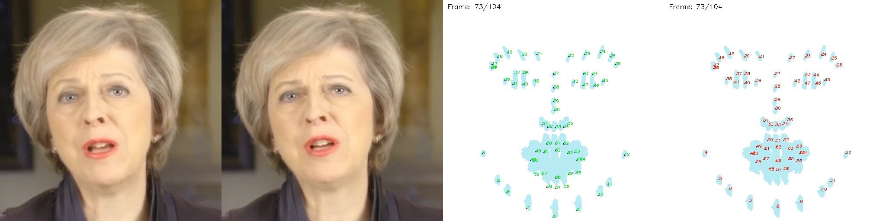
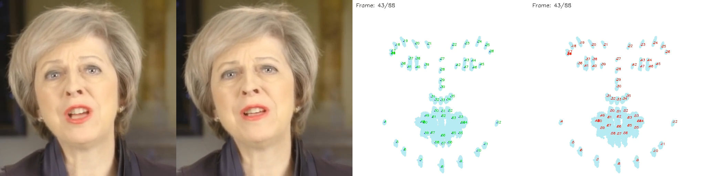
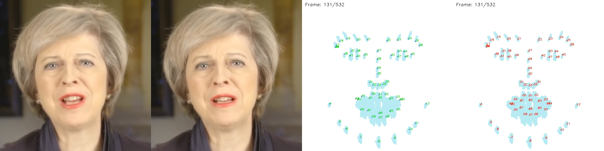

# Emotion Enhanced Talking Head Bot

This repository contains the following two main components:
- The implementation of an emotion-enhanced talking head generation system: `EmoGene`, integrating **EmoTalk** and **GeneFace++** models. The system is designed to generate realistic talking head videos that reflect the emotional tone of the input audio.
- A chatbot application that utilizes various AI models for speech-to-text (STT), voice activity detection (VAD), retrieval-augmented generation (RAG), large language models (LLM), text-to-speech (TTS), and the aforementioned talking head generation system. The chatbot is built on top of the LiveKit platform for real-time communication.

## ChatBot App: `STT+VAD`->`RAG+LLM`->`RAG+TTS`->`Talking Head Generation`
Our App provides multimodal interaction capabilities, allowing users to engage in conversations with an AI agent that can understand and respond with both text and speech, while also generating a talking head video that reflects the emotional tone of the conversation.

### Overall Pipeline

### Models
- **STT(ASR)**: `gpt-4o-transcribe` (OpenAI API)
- **VAD**: `silero` (plugin in the livekit agent)
- **LLM**: `gpt-4.1-mini` (LangChain, using OpenAI API)
- **RAG for LLM (knowledge and memory)**: `text-embedding-3-small` (implement with LangChain, using OpenAI API)
- **RAG for TTS (prompt speech selection)**: `text-embedding-3-small` (implement with LangChain, using OpenAI API)
- **TTS**:  we provide 2 local options:
    - [`IndexTTS2`](https://github.com/index-tts/index-tts/tree/main): high quality and with emotion control, slower (recommended)
    - [`GPT-SoVits`](https://github.com/RVC-Boss/GPT-SoVITS): faster, but no emotion control
- **Talking Head Generation**: `EmoGene` (based on [`EmoTalk`](https://github.com/psyai-net/EmoTalk_release) and [`GeneFace++`](https://github.com/yerfor/GeneFacePlusPlus)), see our simple demo below or go [`docs/EmoGene.md`](https://github.com/Aaron1028f/EmoEnhancedProject/blob/main/docs/EmoGene.md) for more details, including video demo and implementation pipeline.
- **Frontend and Network Communication**: All based on [`LiveKit`](https://docs.livekit.io/home/), including the web UI (temporarily using livekit playground).

### Web App Demo: **Dr. Feng's Virtual Online Clinic**

> Users can chat with [`Dr. Feng`](https://www.youtube.com/@xhealthlab) for any consultation, and Dr. Feng will respond with both text and speech based on his expertise and personality.

## EmoGene: Our novel emotion-enhanced talking head generation, combining EmoTalk and GeneFace++ for speech emotion-aware talking head synthesis.
See [`docs/EmoGene.md`](https://github.com/Aaron1028f/EmoEnhancedProject/blob/main/docs/EmoGene.md) for more details of **Model Pipeline** and **Video Demo**.

Go `server/models/GeneFacePlusPlus/emogene` for code and more implementation details of **EmoGene**.

---

### Demo of EmoGene results 
The following pictures show the results of EmoGene given different emotions.

For each picture, we provide comparisons from left to right:

||`EmoGene(ours)` || `GeneFace++` || `EmoGene landmarks(ours)` || `GeneFace++ landmarks`||

#### **Happy**

<video src="https://github.com/user-attachments/assets/88ad61df-cea5-4cff-abcf-d7860eda7aa1" controls="controls" style="max-width: 720px;">
</video>

#### **Surprised**

<video src="https://github.com/user-attachments/assets/945fd19d-7402-4e6a-88f2-f35d2da0916c" controls="controls" style="max-width: 720px;">
</video>

#### **Angry**

<video src="https://github.com/user-attachments/assets/e1dcbe06-574e-475d-b11d-f07e08b20226" controls="controls" style="max-width: 720px;">
</video>

#### **Sad**

<video src="https://github.com/user-attachments/assets/405218dc-08d0-438b-83f7-01694f639d37" controls="controls" style="max-width: 720px;">
</video>

#### **Fearful**

<video src="https://github.com/user-attachments/assets/d72a8439-b559-4874-9114-983937d32c7b" controls="controls" style="max-width: 720px;">
</video>

#### **Neutral**

<video src="https://github.com/user-attachments/assets/e8320458-c013-4bd5-b09a-98691720e027" controls="controls" style="max-width: 720px;">
</video>

#### **Laughter in Audio**

<video src="https://github.com/user-attachments/assets/2ae52c99-b35a-412b-91b6-68a6a425d2cf" controls="controls" style="max-width: 720px;">
</video>

